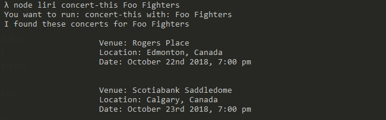
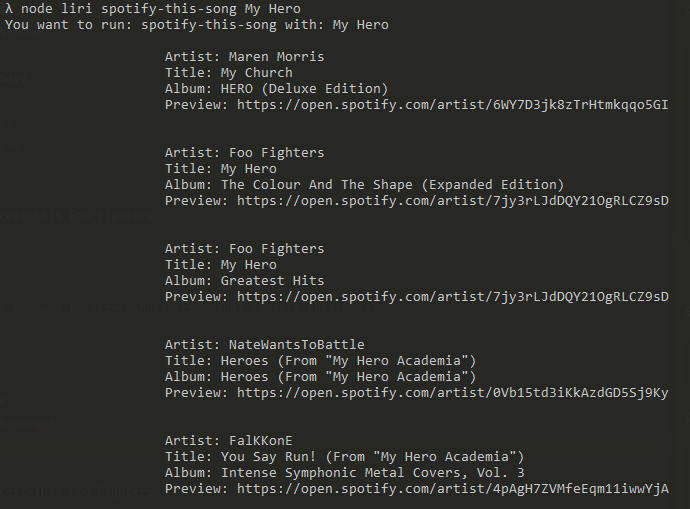
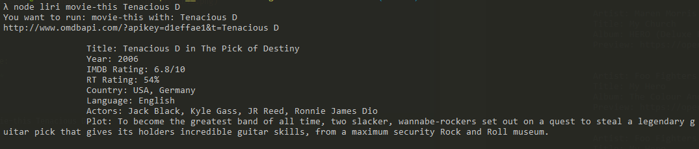
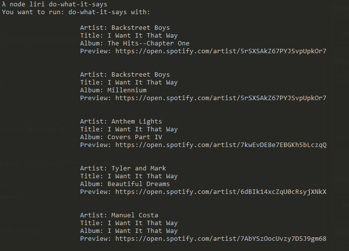

# LiriBot

Welcome to LiriBot. This is a node.js bot that will take in two arguments passed through your CLI. 

```
node liri [task to run] [term to search]
```
###### Task to Run:
* concert-this
* spotify-this-song
* movie-this
* do-what-it-says

###### Example:

**concert-this**

```
node liri concert-this Foo Fighters
```

*Results:*



------

###### Example:
**spotify-this-song**

```
node liri concert-this My Hero
```

*Results:*


------

###### Example:
**movie-this**

```
node liri movie-this Tenacious D
```

*Results:*


###### Example:
**do-what-it-says**

This command will take whatever data is in the `random.txt` file and pass them through the bot as a `[task] [term]` pairing.

random.txt contents:
```
spotify-this-song,"I Want it That Way"
```

```
node liri do-what-it-says
```

*Results:*
